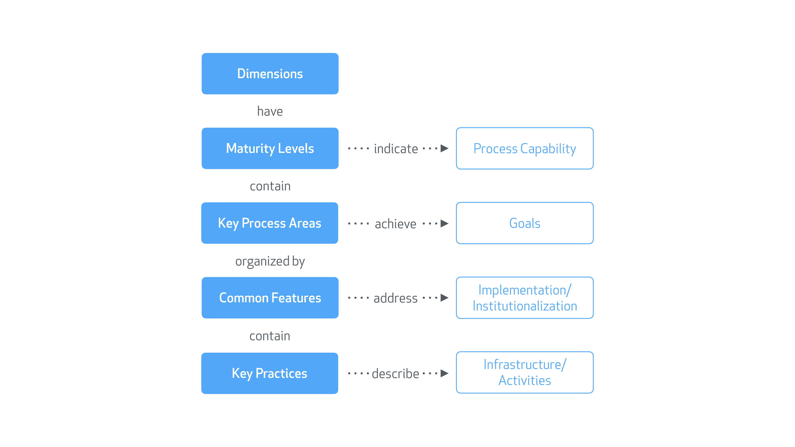

# A maturity model for embracing open source

A [maturity model](http://martinfowler.com/bliki/MaturityModel.html) is a tool to assess the effectiveness of behaviors, practices and processes in producing the desired outcomes. The model defines a set of structured levels that lead an organization down a path of more systematically organized and mature processes.

Embracing open source software is not a single act, but a series of steps, varying in complexity, that require unique knowledge and processes at each step. A maturity model for embracing open source software will guide an organization through the process of successfully adopting open source.

## Objectives

An organization applying the maturity model aims to:

- Produce higher quality products and services built on open source software components.
- Create value by using open source as a force multiplier, shifting limited resources from low-value work to high-value work, focusing on core competencies, and benefiting from the expertise of the community.
- Gain industry-wide recognition that serves as advertising, recruiting, or general leadership.

## Actors

There are several roles in an organization that face unique benefits and challenges with adopting open source.

- **Developers** interact directly with the code and witness the material benefits of open source. They experience the difference between writing custom code and finding high-quality reusable components on the internet.
- **Technical leadership** benefits from the increase in quality and efficiency of their teams, but has to be aware of the long-term consequences of the adopted technologies.
- **Security** benefits from software that is open for inspection and has been potentially reviewed and hardened by the community, but has to continuously monitor for un-vetted code as well as vulnerabilities and exposures.
- **Operations** benefit from reduced costs for software procurement and licensing.
- **Legal** benefits from standardized software licenses, but has to monitor for intellectual property concerns.
- **Business leadership** benefits from increased efficiency and quality, the reduction of unnecessary overhead, and the opportunity for alternate business models, but has to navigate the risk of disrupting core business value.

## Structure

This maturity model is inspired by the [Capability Maturity Model](https://en.wikipedia.org/wiki/Capability_Maturity_Model). The model involves six components:

- **Dimensions:** aspects that require maturity in different _Key Process Areas_.

- **Maturity Levels:** a continuum of five level levels that indicate the ability for processes to produce the desired results.

- **Key Process Areas:** a cluster of related activities that, when performed together, achieve a set of goals considered important.

- **Goals:** The goals signify the scope, boundaries, and intent of each key process area, and the extent to which the goals have been accomplished is an indicator of capability at that maturity level.

- **Common Features:** practices that implement and institutionalize a key process area. There are five types of common features: commitment to perform, ability to perform, activities performed, measurement and analysis, and verifying implementation.

- **Key Practices:** elements of infrastructure and practice that contribute most effectively to the implementation and institutionalization of the area.

## Dimensions

There are three dimensions to embracing open source:

1. Consuming open source software.
2. Contributing back to the open source projects you consume.
3. Producing your own open source software.

## Levels

1. **Ad-hoc** - a new or undocumented process is uncontrolled, reactive and unpredictable, typically driven by individuals without coordination or communication. Success depends on individual heroics.

2. **Managed** - a process is partially documented, possibly leading to consistent results. Success depends on discipline.

3. **Defined** - a process is documented, standardized, and integrated into other processes. Success depends on automation.

4. **Measured** - the process is quantitatively managed. Success depends on measuring metrics against business goals.

5. **Optimized** - the process is continually and reliably improving through both incremental and innovative changes. Success depends on reducing the risk of change.

## Potential applications of the Maturity Model

The maturity model is being developed with two primary goals in mind:

- Evaluating how GitHub products, programs, services, and resources are helping customers develop more mature practices around open source.

- Creating a comprehensive _starter kit_ that includes all the resources needed to use, contribute to, release, and manage open source projects on GitHub.

## Current Status

The maturity model is currently a very early concept and actively being developed.

* [Sticky Notes for brainstorming the activities involved in open source](https://stickies.io/boards/564eda3fefefba0b2fe8a072#1)
* Bookmarks, primary sources, and notes are being gathered in an [Evernote notebook](https://www.evernote.com/pub/bkeepers/maturitymodel)

## Credits

- [Wikipedia: Capability Maturity Model](https://en.wikipedia.org/wiki/Capability_Maturity_Model)
- [Martin Fowler: MaturityModel](http://martinfowler.com/bliki/MaturityModel.html)

## License

Copyright © 2016 GitHub, Inc. and Contributors. 

This work is licensed under a [Creative Commons Attribution 4.0 International License](http://creativecommons.org/licenses/by/4.0/).
